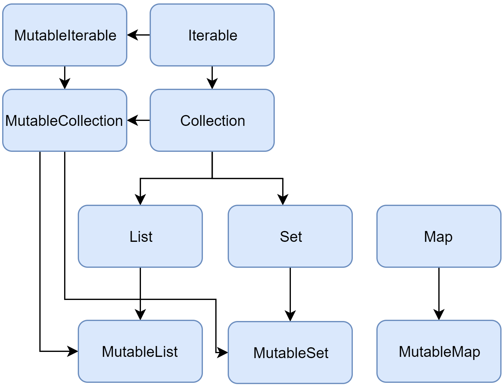

# [`<— Complete Java vs Kotlin Backend Comparison`](../README.md)

## 🧰 Collections and Streams

### Kotlin vs Java Collections



| **Kotlin Collection**    | **Mutable?** | **Java Equivalent**                | **Notes**                                                                                             |
| ------------------------ | ------------ | ---------------------------------- | ----------------------------------------------------------------------------------------------------- |
| `List<T>`                | ❌ Immutable | `java.util.List` (read-only view)  | Read-only view in Kotlin, but backed by a Java `List`. Not truly immutable.                           |
| `MutableList<T>`         | ✅ Mutable   | `java.util.List` / `ArrayList`     | Can add/remove elements. Typically backed by `ArrayList`.                                             |
| `Set<T>`                 | ❌ Immutable | `java.util.Set` (read-only view)   | Read-only view, backed by a Java `Set`.                                                               |
| `MutableSet<T>`          | ✅ Mutable   | `java.util.Set` / `HashSet`        | Backed usually by `HashSet`.                                                                          |
| `Map<K, V>`              | ❌ Immutable | `java.util.Map` (read-only view)   | Read-only view, backed by Java `Map`.                                                                 |
| `MutableMap<K, V>`       | ✅ Mutable   | `java.util.Map` / `HashMap`        | Can put/remove key-value pairs.                                                                       |
| `Array<T>`               | ✅ Mutable   | `T[]` (Java arrays)                | Fixed-size, mutable array. Unlike `List`, supports primitive arrays (`IntArray`, `DoubleArray`, etc). |
| `IntArray`, `LongArray`… | ✅ Mutable   | `int[]`, `long[]`…                 | Specialized primitive arrays to avoid boxing.                                                         |
| `Sequence<T>`            | ❌ Immutable | `java.util.stream.Stream<T>`       | Lazy, one-pass iteration (similar to Java streams).                                                   |
| `Iterable<T>`            | ❌ Immutable | `java.lang.Iterable<T>`            | Base type for collections, just like in Java.                                                         |
| `MutableIterable<T>`     | ✅ Mutable   | `java.lang.Iterable<T>` + mutation | Can remove via iterator.                                                                              |

#### **Key Differences**

- Kotlin makes a **clear distinction** between **read-only (`List`, `Set`, `Map`)** and **mutable (`MutableList`, `MutableSet`, `MutableMap`)** collections.  
  In Java, mutability is implicit depending on the implementation (`List` could be backed by `ArrayList` or `Collections.unmodifiableList`).
- Kotlin `List`, `Set`, and `Map` are **interfaces**, not truly immutable; they just **don’t expose mutating methods**.
- Kotlin provides **primitive arrays** (`IntArray`, `DoubleArray`, etc.) for performance, which Java handles with native arrays.
- Kotlin `Sequence` is lazy like Java `Stream`, but simpler and without parallel execution support.

---

### List, Set, Map

**Java:**

```java
import java.util.*;
import java.util.stream.Collectors;

public class CollectionExamples {
    public void demonstrateCollections() {
        // List
        List<String> languageList = new ArrayList<>();
        languageList.add("Java");
        languageList.add("Kotlin");
        languageList.add("Java");
        System.out.println("List: " + languageList); // [Java, Kotlin, Java]

        // Set
        Set<String> languageSet = new HashSet<>();
        languageSet.add("Java");
        languageSet.add("Kotlin");
        languageSet.add("Java"); // Duplicate is ignored
        System.out.println("Set: " + languageSet); // [Java, Kotlin]

        // Map
        Map<String, Integer> languageRanking = new HashMap<>();
        languageRanking.put("Java", 2);
        languageRanking.put("Kotlin", 1);
        System.out.println("Map: " + languageRanking); // {Java=2, Kotlin=1}

        // Immutable collections (since Java 9)
        List<String> immutableList = List.of("Go", "Rust");
        // immutableList.add("C++"); // Throws UnsupportedOperationException
    }
}
```

**Kotlin:**

```kotlin
fun demonstrateCollections() {
    // List (immutable by default)
    val languageList = listOf("Kotlin", "Java", "Kotlin")
    println("Immutable List: $languageList") // [Kotlin, Java, Kotlin]

    // Mutable List
    val mutableLanguageList = mutableListOf("Kotlin", "Java")
    mutableLanguageList.add("Go")
    println("Mutable List: $mutableLanguageList") // [Kotlin, Java, Go]

    // Set (immutable by default)
    val languageSet = setOf("Kotlin", "Java", "Kotlin") // Duplicates ignored
    println("Immutable Set: $languageSet") // [Kotlin, Java]

    // Map (immutable by default)
    val languageRanking = mapOf("Kotlin" to 1, "Java" to 2)
    println("Immutable Map: $languageRanking") // {Kotlin=1, Java=2}

    // Mutable Map
    val mutableRanking = mutableMapOf("Kotlin" to 1, "Java" to 2)
    mutableRanking["Go"] = 3
    println("Mutable Map: $mutableRanking") // {Kotlin=1, Java=2, Go=3}
}
```

#### Common methods

- Kotlin collections are much more concise, with operators like [], in, +, union, intersect.

- Most “stream” operations in Java (map, filter, groupingBy) are direct methods in Kotlin collections.

- Read-only (List, Set, Map) vs mutable (MutableList, MutableSet, MutableMap) distinction is unique to Kotlin.

##### 📋 Lists

| **Operation**       | **Kotlin (List / MutableList)**     | **Java (List / ArrayList, Streams)**           | **Notes**                                |
| ------------------- | ----------------------------------- | ---------------------------------------------- | ---------------------------------------- |
| Create list         | `val list = listOf(1, 2, 3)`        | `List<Integer> list = Arrays.asList(1, 2, 3);` | Kotlin `listOf` is read-only by default. |
| Create mutable list | `val list = mutableListOf(1, 2, 3)` | `List<Integer> list = new ArrayList<>(...)`    | Fully mutable.                           |
| Access element      | `list[0]`                           | `list.get(0)`                                  | Kotlin uses `[]` operator.               |
| Add element         | `list.add(4)`                       | `list.add(4)`                                  | Same in mutable lists.                   |
| Remove element      | `list.remove(2)`                    | `list.remove(Integer.valueOf(2))`              | Simpler in Kotlin.                       |
| Iterate             | `for (x in list) { ... }`           | `for (Integer x : list) { ... }`               | Cleaner syntax.                          |
| Map elements        | `list.map { it * 2 }`               | `list.stream().map(x -> x * 2).toList()`       | Kotlin much shorter.                     |
| Filter elements     | `list.filter { it > 2 }`            | `list.stream().filter(x -> x > 2).toList()`    | Same semantics.                          |
| Sort                | `list.sorted()` / `sortedBy { it }` | `Collections.sort(list)` / streams             | Kotlin more expressive.                  |
| Distinct            | `list.distinct()`                   | `list.stream().distinct().toList()`            | Direct helper.                           |

##### 🔀 Sets

| **Operation**      | **Kotlin (Set / MutableSet)**     | **Java (Set / HashSet, Streams)**                                         | **Notes**                 |
| ------------------ | --------------------------------- | ------------------------------------------------------------------------- | ------------------------- |
| Create set         | `val set = setOf(1, 2, 3)`        | `Set<Integer> set = new HashSet<>(Arrays.asList(1,2,3));`                 | Immutable in Kotlin.      |
| Create mutable set | `val set = mutableSetOf(1, 2, 3)` | `Set<Integer> set = new HashSet<>();`                                     | Fully mutable.            |
| Add element        | `set.add(4)`                      | `set.add(4)`                                                              | Same.                     |
| Remove element     | `set.remove(2)`                   | `set.remove(2)`                                                           | Same.                     |
| Contains element   | `2 in set`                        | `set.contains(2)`                                                         | Kotlin has `in` operator. |
| Union              | `set1 union set2`                 | `Stream.concat(set1.stream(), set2.stream()).collect(Collectors.toSet())` | Operator style in Kotlin. |
| Intersect          | `set1 intersect set2`             | `set1.retainAll(set2)` or Streams                                         | Much cleaner in Kotlin.   |
| Subtract           | `set1 subtract set2`              | `set1.removeAll(set2)`                                                    | Direct in Kotlin.         |
| Iterate            | `for (x in set)`                  | `for (Integer x : set)`                                                   | Similar.                  |

##### 🗺️ Maps

| **Operation**       | **Kotlin (Map / MutableMap)**            | **Java (Map / HashMap, Streams)**                 | **Notes**                                |
| ------------------- | ---------------------------------------- | ------------------------------------------------- | ---------------------------------------- |
| Create map          | `val map = mapOf(1 to "a", 2 to "b")`    | `Map<Integer, String> map = Map.of(1,"a",2,"b");` | `to` is Kotlin’s infix pair constructor. |
| Create mutable map  | `val map = mutableMapOf(1 to "a")`       | `Map<Integer,String> map = new HashMap<>();`      | Fully mutable.                           |
| Get value           | `map[1]`                                 | `map.get(1)`                                      | Kotlin uses `[]` operator.               |
| Put value           | `map[3] = "c"`                           | `map.put(3, "c")`                                 | Cleaner in Kotlin.                       |
| Remove key          | `map.remove(2)`                          | `map.remove(2)`                                   | Same.                                    |
| Iterate keys/values | `for ((k,v) in map) { ... }`             | `for (Map.Entry<K,V> entry : map.entrySet())`     | Destructuring in Kotlin.                 |
| Keys only           | `map.keys`                               | `map.keySet()`                                    | Property vs method.                      |
| Values only         | `map.values`                             | `map.values()`                                    | Same.                                    |
| Filter by key/value | `map.filter { it.key > 1 }`              | `map.entrySet().stream().filter(...).toMap()`     | Kotlin simpler.                          |
| Transform values    | `map.mapValues { it.value.uppercase() }` | `map.replaceAll((k,v) -> v.toUpperCase())`        | Kotlin returns new map by default.       |
| Merge / combine     | `map1 + map2`                            | `map1.putAll(map2)`                               | `+` operator in Kotlin.                  |

// TODO add callback.

---

### Java Streams vs Kotlin Sequences

**Java Streams:**

- **Lazy evaluation**: Operations on a stream are divided into intermediate (e.g., `filter`, `map`) and terminal (e.g., `collect`).
- Intermediate operations are not executed until a terminal operation is invoked.

```java
public class StreamExample {
    public void processNumbers() {
        List<Integer> numbers = Arrays.asList(1, 2, 3, 4, 5, 6, 7, 8, 9, 10);

        List<Integer> result = numbers.stream()
            .filter(n -> {
                System.out.println("Filtering: " + n);
                return n % 2 == 0;
            })
            .map(n -> {
                System.out.println("Mapping: " + n);
                return n * 2;
            })
            .limit(3)
            .collect(Collectors.toList());

        System.out.println("Result: " + result);
    }
}
```

**Kotlin Sequences:**

- Similar to Java Streams, Sequences provide lazy evaluation for complex data processing pipelines.
- For large collections, `asSequence()` is more performant than direct collection operations as it avoids creating intermediate collections.

```kotlin
fun processNumbers() {
    val numbers = (1..10).toList()

    val result = numbers.asSequence()
        .filter {
            println("Filtering: $it")
            it % 2 == 0
        }
        .map {
            println("Mapping: $it")
            it * 2
        }
        .take(3)
        .toList()

    println("Result: $result")
}
```

### Functional operations: map, filter, reduce

**Java:**

```java
public class FunctionalOperations {
    public void demonstrate() {
        List<Integer> numbers = Arrays.asList(1, 2, 3, 4, 5);

        // map: Transform each element
        List<Integer> squared = numbers.stream()
            .map(n -> n * n)
            .collect(Collectors.toList()); // [1, 4, 9, 16, 25]

        // filter: Select elements that match a predicate
        List<Integer> evenNumbers = numbers.stream()
            .filter(n -> n % 2 == 0)
            .collect(Collectors.toList()); // [2, 4]

        // reduce: Combine elements into a single result
        int sum = numbers.stream()
            .reduce(0, Integer::sum); // 15
    }
}
```

**Kotlin:**

```kotlin
fun demonstrate() {
    val numbers = listOf(1, 2, 3, 4, 5)

    // map: Transform each element
    val squared = numbers.map { it * it } // [1, 4, 9, 16, 25]

    // filter: Select elements that match a predicate
    val evenNumbers = numbers.filter { it % 2 == 0 } // [2, 4]

    // reduce: Combine elements into a single result
    val sum = numbers.reduce { acc, n -> acc + n } // 15

    // fold is like reduce but with an initial value
    val sumWithInitial = numbers.fold(0) { acc, n -> acc + n } // 15
}
```
